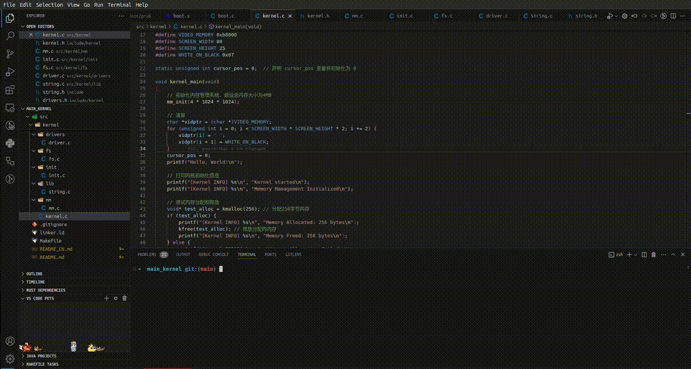

# 我的操作系统


这是一个简单的操作系统项目，旨在帮助初学者学习内核开发。项目包括基本的引导、多重引导头部和一个简单的主函数，该函数将字符串输出到屏幕上。

## 目录结构

```
.
├── boot
│   └── grub
│       └── grub.cfg
├── docs
│   ├── Kernel Development Notes CN.md
│   └── Kernel Development Notes.md
├── efi
│   └── boot
├── include
│   ├── kernel
│   │   ├── drivers.h
│   │   ├── fs.h
│   │   ├── init.h
│   │   ├── kernel.h
│   │   └── mm.h
│   └── string.h
├── iso
│   ├── boot
│   │   └── grub
│   │       └── grub.cfg
│   └── efi
│       └── boot
│           └── bootx64.efi
├── linker.ld
├── Makefile
├── README_CN.md
├── README.md
└── src
    ├── boot
    │   ├── bios
    │   │   └── boot.s
    │   └── efi
    │       └── boot.c
    └── kernel
        ├── arch
        │   └── x86
        │       └── startup.S
        ├── drivers
        │   └── driver.c
        ├── fs
        │   └── fs.c
        ├── init
        │   └── init.c
        ├── kernel.c
        ├── lib
        │   └── string.c
        └── mm
            └── mm.c
```

### 目录结构说明

- **boot/**: 包含用于引导操作系统的 GRUB 配置文件。
- **docs/**: 包含内核开发的文档，提供中文和英文版本。
- **efi/**: 包含用于 EFI 启动的引导文件。
- **include/**: 项目的头文件，其中：
  - **kernel/**: 包含内核的头文件，如驱动程序、文件系统、初始化、内核和内存管理。
  - **string.h**: 通用字符串操作的头文件。
- **iso/**: 镜像了用于 ISO 创建的 boot 目录结构。这是构建可引导 ISO 的地方。
- **linker.ld**: 用于链接内核的链接脚本。
- **Makefile**: 自动化构建过程的 makefile。
- **README.md** 和 **README_CN.md**: 分别提供项目的英文和中文信息、构建指导和使用方法。
- **src/**: 源代码文件，分为：
  - **boot/**: 包含 EFI 和 BIOS 的低级汇编引导文件。
  - **kernel/**: 包含内核相关的 C 源文件和架构特定的启动代码。

### 安装工具

#### 对于Linux用户（例如Ubuntu）

1. 更新包列表并安装必要的工具：

    ```sh
    sudo apt update
    sudo apt install build-essential gcc g++ binutils nasm qemu-system-x86 grub-pc-bin xorriso mtools gnu-efi
    ```

2. 安装交叉编译工具链（可选）：

    ```sh
    sudo apt install gcc-multilib g++-multilib
    ```

#### 对于Windows用户

在Windows上，可以通过安装MSYS2来获得类似Linux的开发环境。

1. 下载并安装MSYS2：
    - 前往 [MSYS2官网](https://www.msys2.org/) 下载并安装MSYS2。
2. 更新MSYS2：
    打开MSYS2 MSYS终端，运行以下命令以更新包管理器：

    ```sh
    pacman -Syu
    ```

3. 安装必要的工具：
    打开MSYS2 MSYS终端，运行以下命令安装GCC、NASM和QEMU：

    ```sh
    pacman -S base-devel mingw-w64-x86_64-gcc mingw-w64-x86_64-binutils mingw-w64-x86_64-nasm mingw-w64-x86_64-qemu
    ```

## 学习目标

### 前提条件
在深入进行内核开发之前，了解以下基础知识非常重要：

1. **计算机体系结构**：了解计算机的工作原理，包括CPU、内存和输入/输出操作。
2. **汇编语言**：掌握基本的汇编语言，特别是x86架构，这有助于理解低级操作。
3. **C语言编程**：精通C语言编程，因为大多数内核（包括Linux）都是用C语言编写的。
4. **操作系统概念**：熟悉基本的操作系统概念，如进程、内存管理、文件系统和硬件抽象。

### 推荐资源

1. **书籍**：
   - 《操作系统：设计与实现》作者：Andrew S. Tanenbaum
   - 《深入理解计算机系统》作者：Randal E. Bryant 和 David R. O'Hallaron
   - 《从零开始学编程》作者：Jonathan Bartlett（汇编语言）

2. **在线课程**：
   - "Nand to Tetris" (Coursera): 课程从基本的逻辑门到构建一个简单的计算机和操作系统。
   - "Introduction to Computer Systems" (EDX或Coursera): 涵盖计算机体系结构和低级编程。

3. **文档和教程**：
   - [OSDev Wiki](https://wiki.osdev.org/): 一个全面的操作系统开发资源。
   - [Linux Kernel Documentation](https://www.kernel.org/doc/html/latest/): 了解Linux内核的结构和功能。

## 开发指南

### 构建项目 / Building the Project

要构建项目（编译正式发布版本时），运行：
```sh
make all
```
或简单地运行：
```sh
make
```

要在调试模式（包含调试信息）下构建项目，运行：
```sh
make DEBUG=yes
```

要清理构建文件，运行：
```sh
make clean
```

### 运行操作系统

使用QEMU运行操作系统：
```sh
qemu-system-i386 -cdrom os-image.iso
```

## 理解源代码

### 汇编引导程序 (src/boot/bios/boot.s)

这个文件包含用汇编语言编写的初始引导程序代码。它设置了多重引导头并将控制权转移到内核的主函数。

[file_link](./src/boot/bios/boot.s)

### 内核主函数 (src/kernel/kernel.c)

内核的主函数初始化系统并在屏幕上打印“Hello, World!”。

[file_link](./src/kernel/kernel.c)

### 内核头文件 (./include/kernel/kernel.h)

这个头文件包含 `kernel_main` 函数的声明。

[file_link](./include/kernel/kernel.h)

### 链接脚本 (linker.ld)

链接脚本定义了内核的内存布局。

[file_link](./linker.ld)

### GRUB配置文件 (boot/grub/grub.cfg)

这个文件包含用于引导内核的GRUB配置。

```cfg
set timeout=0
set default=0

menuentry "My Operating System" {
    multiboot /boot/kernel.bin
    boot
}
```

### Makefile

Makefile自动化内核的构建过程。

[file_link](./Makefile)

## 初学者的挑战

### 常见困难

1. **理解低级概念**：掌握硬件和软件在低级别的交互可能会很困难。这包括理解CPU指令、内存寻址和I/O操作。
2. **调试**：调试内核代码比用户空间应用程序难得多，因为传统的调试工具和技术往往不起作用。学习使用QEMU和GDB等工具进行调试至关重要。
3. **学习汇编语言**：许多初学者不熟悉汇编语言，而这对编写引导程序和其他低级代码是必不可少的。

### 克服挑战的建议

1. **从理论开始**：在开始编写代码之前，确保你有扎实的理论基础。阅读相关书籍并参加操作系统和计算机体系结构课程。
2. **逐步学习**：从小的、易管理的项目开始，逐步积累。例如，先编写一个简单的引导程序，然后再逐步增加复杂的内核功能。
3. **利用在线资源**：充分利用在线社区和资源，如OSDev Wiki和论坛，在那里你可以提问和分享知识。
4. **练习调试**：花时间学习和练习调试技巧。使用像QEMU这样的模拟器在受控环境中运行和测试你的内核。

通过遵循这些步骤并利用提供的资源，初学者可以逐步建立起理解和开发自己操作系统内核的技能和知识。

> 内容待更新,现在仅仅只是初始阶段..

> 为了方便编写说明,我删除了docs文件夹,详细的说明将直接写入到源代码注释内.